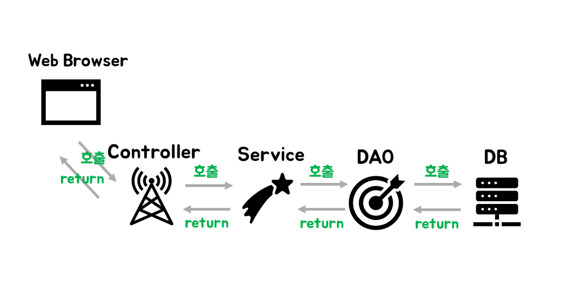

# 📢Spring Controller, Service, Dao

## Web Server 와 database가 소통하는 방식

사진참조 - https://dalpaeng00.tistory.com/83

- 웹브라우저에서 DB와 연동되면 간단히 도식화를 하면 위 그림과 같은 형태를 띈다.
- 기본적인 SpringMVC모델이 DB와 Browser와 소통이 되는 방식이다
- Layered Architecture Pattern으로 나누어진다. 
- 기본적인 Layered Architecture 는 Presentation Layer, Business Layer, Persistence Layer, Database Layer 총 4개의 layer로 구성된다.
- 유저 + 브라우저와 상호작용하는 로직이 잇는 Presentation Layer
- 요청에 맞는 비즈니스 로직을 수행하는 Business Layer
- 데이터를 맵핑하고 관리하는 persistence Layer
- 데이터를 저장하고 관리하여 스토리지와 잇는 Database Layer 

### Controller

-  Presentation Layer 로서 웹브라우저의 요청을 전담하여 처리한다.
-  Browser에서 요청을 받으면 Controller 는 Service를 요청한다.

### Service

- Service는 Business Layer로 비지니스 로직을 수행한다.
- 데이터베이스에 접근하는 DAO를 이용해서 결과를 받아온다.

##### * 비지니스 로직이란???

- 비지니스 로직은 컴퓨터 프로그램에서 실세계 규칙에 따라 데이터를 생성,표시,저장,변경 하는 부분을 일컫는다.
- 데이터베이스에 데이터를 가져와 웹에서 출력을 할때 데이터베이스와 연결, 통신, 자료가공, 페이지 구성 등 여러가지 작업을 하지만 그 중에서 사용자가 원하는 자료의 가공 부분을 의미한다.
- 예를 들면 자료는 저장할때에 부가세는 포함되지않고 자료가 저장되지만 최종적으로 사용자가 보는 화면에는 부가세가 포함되는 자료를 보여주어야하는 상황일 때 이를 처리하는 과정을 의미한다고 볼 수 있다.

### Dao

- DAO는 데이터베이스에 접속하여 비지니스 로직 실행에 필요한 쿼리를 호출한다.

### DB

- DB에서 알맞은 쿼리를 실행하고 결과값을 반환한다.

### DTO

- Data Transfer Object의 약자로
- 각 계층이 데이터를 주고 받을 때 사용하는 객체를 말한다.
- 각 계층이란 view,controller,service,dao,db를 말한다.

##### 참고 사이트

https://jayviii.tistory.com/21

https://onlyformylittlefox.tistory.com/13

https://www.kurien.net/post/view/24

https://velog.io/@betweenhj702/Spring%EC%97%90%EC%84%9C-Service-%EC%9D%B8%ED%84%B0%ED%8E%98%EC%9D%B4%EC%8A%A4%EC%99%80-DAO-%EC%9D%B8%ED%84%B0%ED%8E%98%EC%9D%B4%EC%8A%A4%EB%A5%BC-%EB%A7%8C%EB%93%9C%EB%8A%94-%EC%9D%B4%EC%9C%A0

https://dalpaeng00.tistory.com/83

https://velog.io/@sj950902/%EA%B3%84%EC%B8%B5%ED%99%94-%EC%95%84%ED%82%A4%ED%85%8D%EC%B3%90Layered-Architecture

https://m.blog.naver.com/anjdieheocp/20117559228

