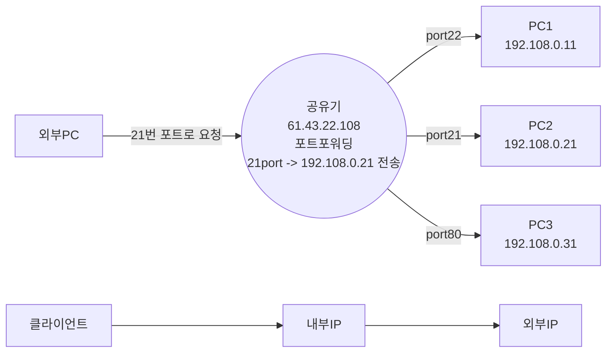

# 누구나 따라 할 수 있는 서버 클론코딩 

## Section2 - port Forwading & AWS

### Protocol

- 클라이언트가 서버에 요청하는 방식
- HTTP : 인터넷에서 서버와 클라이언트가 소통하는 포로토콜
  - PACKET이랑 데이터 형식을 사용한다
  - PACKET은 HEADER 와 BODY로 이루어져있다.
- HTTPS : HTTPS에서 보안이 추가된 버전
- MYSQL 
- SSH : 네트워크상 다른 컴퓨터에 로그인하거나 원격으로 접속하기 위한 프로토콜 
- FTP : 파일 전송하기위한 프로토콜
- SFTP : FTP에서 보안이 추가된 버전

### IP & Port

- 도로명 주소 -> 위도, 경도
- 도메인 주소 -> IP 
- 즉 도메인 주소는 도로명 주소와 같이  IP주소인 숫자를 알기 쉽게 언어로 만들어 놓은것이다.
- Port란 출입하는 입구로 직원용(개발자용), 손님용(사용자용) 으로 나 눌 수 있다..
- 프로토콜 마다 기본적인 포트 번호가 정해져있다.
  - 프로토콜 : 포트번호 
  - http: 80
  - https : 443
  - ssh : 22
  - ftp : 21
  - sftp : 22
  - musql : 3306 

### Request (요청)

- 클라이언트가 요청할시 프로토콜, ip , port가 있어야 요청이 가능하다.

### Port Forwadring

- 포트포워딩이랑 공유기(내부IP)에 외부IP로 길과 이정표를 만들어 주는 기능을 한다.

### AWS 만들기

1. 프리티어 계정으로 AWS를 생성한다.
2. 인스턴스를 생성한다
   -  프리티어 계정은 월 750시간을 무료로 제공한다
   - 인스턴스1개당 24시간 사용시 월 744시간을 사용하는데 2개이상 사용할 경우 과금이 나올 수 있으니 주의가 필요한다.
3. 보안(ssh), 생성한다.
4. OS 는 ubuntu를 선택한다.
5. 용량은 30이 최대 무료 이용 가능하이때문에 30으로 설정한다.
6. 키페어를 생성하여 잘 보관해둔다(중요!!!) <.pem> 파일
7. 보안 설정에서 http를 추가한다.(ipv4, ipv4 각각 1개씩)
8. 탄력적 IP를 생성하여 생성된 인스턴스와 연결해준다.
   - 퍼블릭IP 주소를 탄력적 IP를통해 서버가 꺼졌다 켜저도 고정이된다?
9. win경우 wicscp와 putty를 설치하여 aws와 연결이 가능하다.

