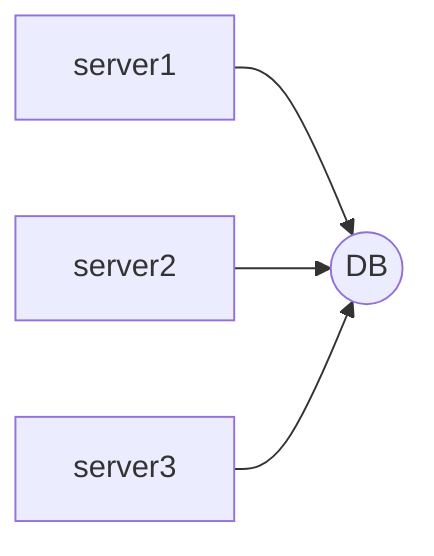

# 누구나 따라 할 수 있는 서버 클론코딩 

## Section4 - DataBase

### RDBMS

- 쿼라(명령)을통해 DB에 전달한다.
- DB는 쿼리만 이해 할 수 있다?
- Structured Query Language(SQL) 이라고 칭한다
  - MYSQL
  - Oracle ... 등 이있다.
- RDBMS란 관계형데이터 베이스라고 말한다.

### 데이터베이스

- 스키마 > 테이블 > 컬럼 
- DDL -> create, alter, drop..
- DML -> Insert, Select, Update, Delete....
- DCL -> 전체적인설정을관리.. Grant, Revoke....

### 논리

1. Entity
   -  객체
   - 테이블
2. Attribute
   - 속성
   - 컬럼
3. Relation
   - 관계

### RDS

- 데이터베이스 서버를 말한다..
- 여러가지 서버를 하나의 DB를 공유하는 것을 말한다.

### AWS RDS 생성

[AWS RDS생성](https://velog.io/@nefertiri/AWS-RDS%EB%A1%9C-%EB%8D%B0%EC%9D%B4%ED%84%B0%EB%B2%A0%EC%9D%B4%EC%8A%A4-%EB%A7%8C%EB%93%A4%EA%B8%B0)

