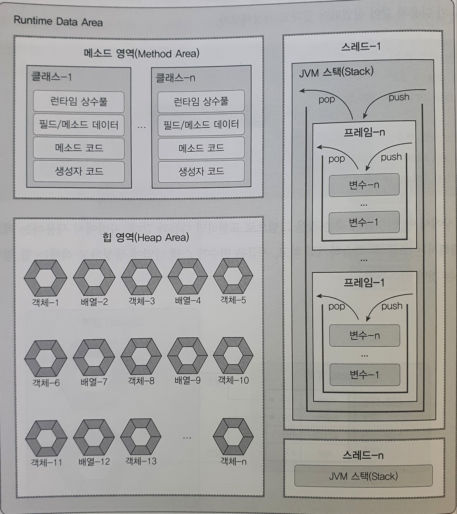

# 📢day07__Java reference type

#### `outter`

- 자바에서만 나오는 특징 for문에서 쓰이며, break를 하고 외부 for문도 같이 break를 만드는 것.

  

```java
	outter:
	for (int i = 2; i < 10; i++) {
		if (i%2 == 1 ) {
			continue;
		}
		System.out.println(i + " 단 시작 --------");
		for (int j = 1; j < 10; j++) {
			if ( i * j == 28) {
				break outter;
			}
			System.out.printf("%d * %d = %d \n", i,j,(i*j));
		}
	}
```

- 28이 나오면 전체 함수가 멈추게 된다.

## 참조타입( reference type)

- 기본타입(primitive type) : 정수, 실수, 문자, 논리
- 참조타입(reference type) : 배열, 열거, 클래스, 인터페이스
- 기본 타입은 실제 값을 변수 안에 저장하지만, 참조 타입은 배열, 열거, 클래스, 인터페이스를 이용해서 선언된 변수는 메모리의 주소를 값으로 갖는다.
- 즉, 주소를 통해 객체를 참조한다는 뜻에서 참조 타입이라고 부른다.
- 참조타입은 힙 영역에 주소를 생성하고 각 값은 스택 영역에 쌓이게 된다.

### 메모리 사용 영역



[^참조]:  이것이 자바다 / 신용권 지음 p140


### reference type 의 연산

#### `==`, `!=` 연산

- 참조타입은 동일한 객체를 참조하는지, 다른 객체를 참조하는지 알아볼 때 사용. 

- 즉, 힙영역의 객체(주소)가 동일한지 확인하는 연산이며 값은 같아도 주소가 다르면 다르게 나온다.

  

### reference type 의 분류

#### (1) null type

- 힙 영역의 객체를 참조하지 않는다는 뜻.
- null값이 대입 되면 객체를 참조하지 않는 듯.
- null값도 초기값으로 사용할 수 있으며, 초기화된 참조 변수는 텅 빈 상태로 스택 영역에 생성 된다.
- 예외가 발생된 곳에서 객체를 참조하지 않은 상태로 참조 타입 변수를 사용 하고 있음을 알아야한다.
- NullPointerException은 가장 많이 볼 수 있는 예외 중 하나이다.

#### (2) String type

- 문자열은 직접 변수에 저장되는 것처럼 보이지만 그렇지 않다.
- 문쟈열은 `String` 객체로 생성되고 변수는 `String` 객체를 참조한다.
- `new` 연산자를 사용하면 새로운 힙 영역에 생성 되기 때문에 같은 값을 가지더라도 다르다. 아래 s1 와 s2 는 같아 보이지만 힙 영역이 달라 `s1==s2` 는 `false`를 토해낸다.

```java
	String s1 = "abc";
	String s2 = new String("abc");
```

- 주소의 값과 상관없이 비교하기 위해서는 객체의 `equals()`메소드를 사용해야 한다. `equals()`매소드는 매개값으로 주어진 비교 문자열이 동일한지 비교한 후 `true`, `false`를 리턴한다.
- 참조를 잃은 String 객체는 쓰레기 객체로 취급하고 메모리에서 자동 제거된다.

#### (3) Array type

- 배열은 같은 타입의 데이터를 연속된 공간에 나열시키고, 각 데이터에 인덱스를 부여해 놓은 자료 구조이다.
- 배열은 같은 타입의 데이터만 저장할 수 있다. (int배열은 int만 String배열은 String만)
- 한 번 생성된 배열은 길이를 늘리거나 줄일 수 없다.
- 배열 변수는 null값으로 초기화 될 수 있다.
- 배열은 주소가 STACK 영역에 저장되고 배열안 각 객체는 HEAP영역에 저장 된다.
- String배열 같은 경우에는 HEAP영역 안에 각 배열 공간의 객체 값을 참조한다.

```java
	int ar [] = new int[4]; // 객체가 4개인 int 배열 생성.
	ar[0] = 0;
	ar[1] = 1;
	ar[2] = 2;
	ar[3] = 3;
// int ar [] = {0,1,2,3} 과 같은 형태로도 가능하다.

	System.out.println(ar); //주소값이 찍힌다.	:[I@626b2d4a
	System.out.println(Arrays.toString(ar)); // 배열의 모든 객체를 출력. :[0, 1, 2, 3]
	for (int i = 0; i < ar.length; i++) {
		System.out.println(ar[i]); // 각 배열의 값 출력. ; 0, 1, 2, 3
	}
```

##### 다차원 배열

- 2차원 배열은 행렬과 같이 행과 열로서 구성된 배열을 말한다.

  ```java
  	int ar [][] = new int [3][];
  	ar[0] = new int[3];
  	ar[1] = new int[3];
  	ar[2] = new int[3];
  // int ar [][] = new int[3][3]; 과 같다.
  ```

- 