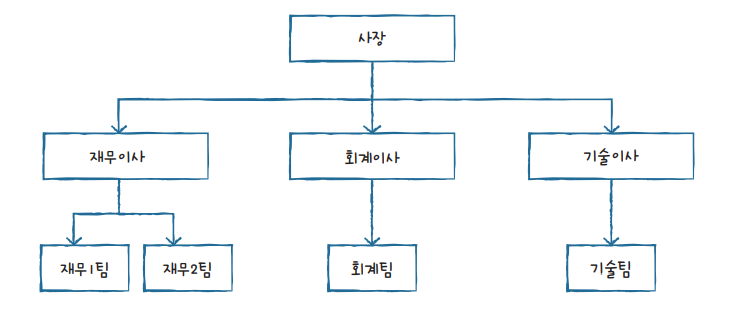
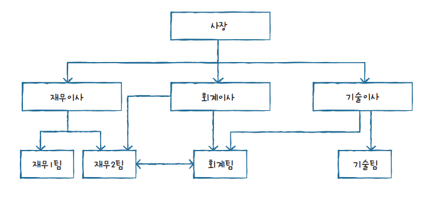
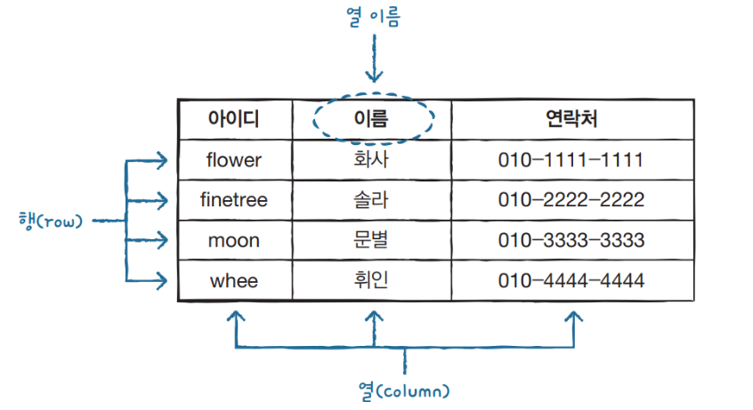

# 📢day17__SQL

## SQL

### 1. 시스템 구축 - MySQL

### 2. DDL, DML

- DDL : CREATE,DROP,ALTER ....
- DML : SELECT,INSERT,DELETE,UPDATE, .....

### 3. ERD

- 요구사항 정의.
- 테이블을 설계 하고 구축.

## DBMS(DataBase Management System)

- 파일시스템의 단점을 보완하고 데이터르 보다 효율적으로 관리하고 운영하기 위해서 사용되기 시작한것이 DBMS이다.
- DBMS는 데이터의 집합인 '데이터베이스'를 잘 관리하고 운영하기 위한 시스템 또는 소프트웨어를 말한다.
- DBMS에 데이터를 구축하고 관리하기 활용하기 위해서 사용되는 언어가 SQL(Structured Query Language)이다.

### DBMS분류

#### (1) 계층형 DBMS

- 최초로 나온  DBMS 개념.
- 각 계층은 트리tree 형태를 가지며 1:N 관계를 갖는다.

[사진참조](https://hongong.hanbit.co.kr/%EB%8D%B0%EC%9D%B4%ED%84%B0%EB%B2%A0%EC%9D%B4%EC%8A%A4-%EC%9D%B4%ED%95%B4%ED%95%98%EA%B8%B0-databasedb-dbms-sql%EC%9D%98-%EA%B0%9C%EB%85%90/)

#### (2) 망형 DBMS

- 계층형 DBMS의 문제점을 개선하기위해 만들어졌다.
- 1:1, 1:N, N:M 관계가 지원되고 효과적이고 빠른 데이터 추출이 가능해졌다.
- 계층형과 마찬가지로 매우 복잡한 내부 포인터를 사용하고 프로그래머가 이 모든 구조를 이해해야만 프로그램의 작성이 가능하다는 단점을 여전히 가지고 있다.

[사진참조](https://hongong.hanbit.co.kr/%EB%8D%B0%EC%9D%B4%ED%84%B0%EB%B2%A0%EC%9D%B4%EC%8A%A4-%EC%9D%B4%ED%95%B4%ED%95%98%EA%B8%B0-databasedb-dbms-sql%EC%9D%98-%EA%B0%9C%EB%85%90/)

#### (3) 관계형 DBMS

- RDBMS라하며 "데이터베이스 테이블"이라 불리는 최소 단위로 구성 되어있다.
- RDBMS에서는 모든 데이터가 테이블에 저장된다.
- RDBMS는 테이블로 이루어져 있으며, 테이블은 열과 행으로 구성되어 있다.
- 시스템자원을 많이 차지해서 전반적으로 시스템이 느리다는 단점이 있지만, 최근 들어서 하드웨어의 급속한 발전으로 인해 이러한 단점이 보완되고 있다.

[사진참조](https://hongong.hanbit.co.kr/%EB%8D%B0%EC%9D%B4%ED%84%B0%EB%B2%A0%EC%9D%B4%EC%8A%A4-%EC%9D%B4%ED%95%B4%ED%95%98%EA%B8%B0-databasedb-dbms-sql%EC%9D%98-%EA%B0%9C%EB%85%90/)

## 표준SQL

- SQL은 특정 회사에서 만드는 것이 아니라 국제표준화기구에서 SQL에 대한 표준을 정해서 발표하고 있다.
- DBMS를 만드는 회사가 여러곳이 있기 때문에 각 제품의 특성을 반영한 SQL을 사용한다.

#### mysql 테이블 컬럼생성/ 추가 / 삭제 / 수정

[mysql DB , 테이블 , 컬럼 생성/수정/추가/삭제 문법](https://velog.io/@bungouk6829/mysql-DB-%ED%85%8C%EC%9D%B4%EB%B8%94-%EC%BB%AC%EB%9F%BC-%EC%83%9D%EC%84%B1%EC%88%98%EC%A0%95%EC%B6%94%EA%B0%80%EC%82%AD%EC%A0%9C)

