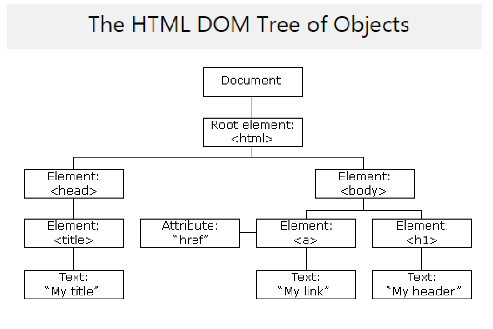

# 📢day27__javascript


## JavaScript

### Javascript의 탄생 배경과 발전.

- Netscape 사가 1996년 2월 자바언어를 기반으로 하여 웹 브라우저에서 실행하는 스트립트언어로 발표되었다.
- HTML의 정적인 부분을 JavaScript를 이용하여 다이나믹한 UI와 이벤트를 처리에 사용되며 여러 브라우저 업체들이 벤더에 특화된 스크립트로 발전 하기 시작 한다.
- 모바일웹 및 다양한 웹 개발 분야에서 단순 Livrary로 사용되던 JavaScirpt는 Angular JS와 같은 프레임워크로 발전 되며 세계에서 가장 많이 사용되는 언어로 발전 하게 된다.
- OOP를 지원함으로서 기존의 스크립트 언어의 한계를 극복.
- 2005년 AJAX를 발표 하면서 비동기 프로그래밍 가능하도록 발전
- 2006년 JQuery의 발표로 크로그 브라우진이 가능한 스크립트 언어로 발전
- 2009년 Node.js를 통해 서버 사이드의 스크립트화
- 2014년 구글의 Angular JS 발표를 통한 Framework기반 개발 환경 개발 구축


### JavaScript의 필요성

- HTML 내부 Contest를 자유롭게 변경 추가가 가능하다.
- CSS를 자유롭게 변경 가능하다.
- Event를 처리 Vaildation.
  - JavaScript를 통해 화면에 입련된 데이터의 검정 작업 가능
  - 화면에서 이벤트 처리 및 이벤트시 행위를 제어 가능
- Web Page에서의 프로그램 부분을 담당한다.
  - 다양한 API를 제공하고 HTML5에서의 프로그램 부분을 담당한다.

### JavaScript Datatype

- JavaScript에서 변수 선언은 const,let,var 총 3가지로 할 수 있으며 var은 코드의 오염이 생길 수 있어 지양한다.
  - const : 재선언, 재할당 금지
  - let : 재언언 금지, 재할당 가능
  - var : 재선언, 재할당 가능.

```javascript
// undefined
var data1;

//number 정수,실수 구분없음
var num1 = 100;
var num2 = 200.123;

//String 문자열 charcter 모두 포함.
var str1 = 'abc';
var str2 = "abc";

// boolean
var b = true;

//object
var obj1 = {
    id : 'id01',
    pwd : 'pwd01',
    name : '홍일동'
};

//array
var arr = [1,2,"srt",{'a':1}];

//function
var func = function(){
    return 100;
}
// javascript에서는 함수안에 함수를 넣을 수 있다.
function c(){
    return function(){
        return 100;
    };

};

let r1 = c();
let result2 = r1();
alert(result2); // return 100

function d(f){

};

let dd = function(){
    return 100;		
};
const result3 = d(dd);
alert(result3); // return 100
```

- #### [Javascript 공식 문서](https://developer.mozilla.org/ko/docs/Web/JavaScript)

### JSON

- JavaScript Object Notation의 약자이다.
- 경량 형식으로 데이터들을 시스템 간 전송하는데 사용된다.
- JavaScript에서 해석과 데이터추출이 편리하다.
- JSON형태 데이터

```json
{"employees":[
    {"firstName":"John","lastName":"Doe"},
    {"firstName":"Anna","lastName":"Smith"},
    {"firstName":"Peter","lastName":"Jones"}
]}
```


### DOM(Document Object Model)

- W3C문서 객체 모델로서 W3C에서 제정한 문서이다. 
- 프로그램 및 스트립트를 동적으로 액세스하여 문서의 콘텐츠, 구조 및 스타일을 갱싱 할 수 있도록 플랫폼 및 언어 중립 인터페이스이다.
- HTML DOM은 웹 브라우져를 위한 문서 표준이며 HTML을 위한 프로그램 인터페이스 이다.
  - 모든 HTML의 tag요소를 Object라 칭한다.
  - 모든 HTML의 tag요소의 Property를 설정 할 수 있다.
  - 모든 HTML의 tag요소를 변경, 추가, 삭제가 가능 하다
  - 모든 HTML의 tag요소에 Event를 발생 시킬 수 있다.
  - 모든 HTML의 tag요소의 Contents를 변경 할 수 있다.
- JavaScript를 통해 HTML DOM을 접근 하고 위의 모든 작업을 진행 한다.
- HTML DOM과 JavaScript를 이용하여 동적 HTML을 만들 수 있다.
  - javascript는 페이지에 있는 모든 HTML 요소를 변경할 수 있다.
  - javascript는 모든 HTML 페이지의 속성을 변경할 수 있다.
  - javascript는 페이지에있는 모든 CSS 스타일을 변경할 수 있다.
  - javascript는 HTML 요소와 속성을 제거 할 수 있다.
  - javascript는 새로운 HTML요소와 속성을 추가 할 수 있다.
  - javascript는 모든 이벤트를 제어 할 수 있다.
  - javascript는 모든 HTML TAG에 이벤트를 만들 수 있다.


#### DOM의 종류

1. Core DOM: 모든 문서 형식에 대한 표준 모델
2. HTML DOM: HTML문서의 표준 모델
   1. HTML문서를 조작하고 접근하는 표준화된 방법을 정의
   2. 모든 HTML요소는 HTML DOM을 통해 접근할수 있다.
3. XML DOM: XML 문서의 표준 모델
   1. XML문서에 접근하며, 그 문서를 다루는 표준화된 방법을 정의
   2. 모든 XML요소는 XML DOM을 통해 접근할 수 있다.




### Finding HTML Element

- document.getElementById(" ");
- document.getElementByTagName(" ");
- document.getElementByClassName(" ");
- document.querySelector(".class #id");
- document.querySelectorAll(" ");

### Changing HTML Element

- element.innerHTML =   : element 애부의 내용을 변경한다. 
- element.attribute =   : 속성 값을 변경 한다.
- element.setAttribute(attribute, value) : 속성 값을 변경 한다.
- element.style.property = Style를 변경한다.


### BOM(Browser Object Model)

- 자바스크립트를 통해 브라우저에서 제공 하는 기능을 제어 하는 방법을 제공한다.
  - window : Brower 창 정보를 사용 할 수 있다
  - screen : 현재 시스템의 화면 정보를 사용 할 수 있다.
  - location : URL정보를 사용할 수 있다.
  - navigator : 웹 브라우저 정보를 사용 할 수 있다.
  - popup : 다양한 popup box를 제공 한다.
  - timing: 다양한 Timer를 사용 할 수 있다.